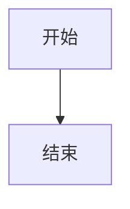
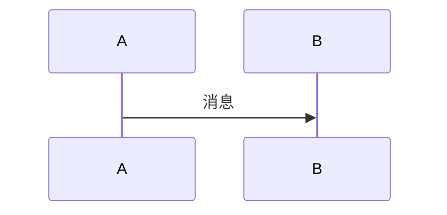
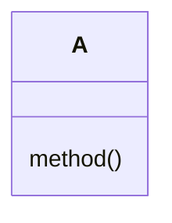
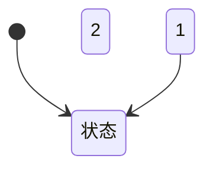
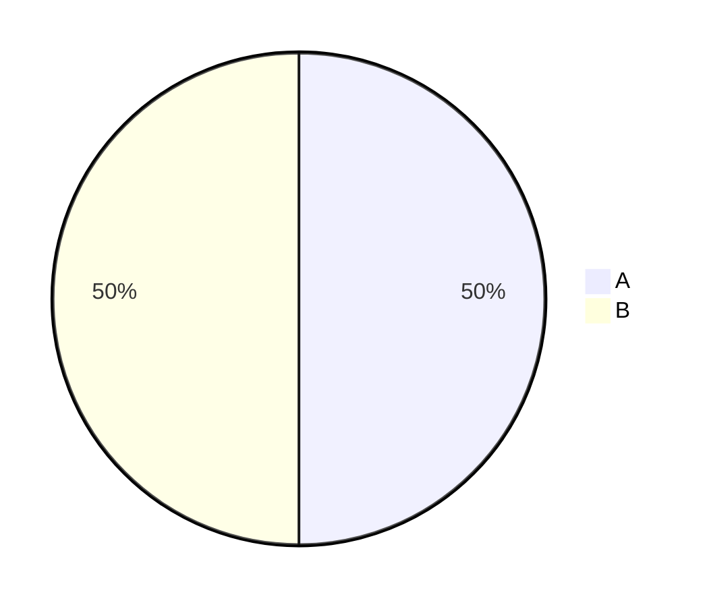
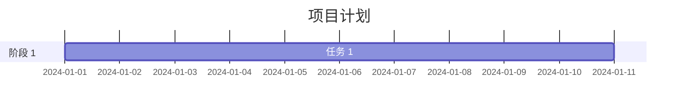
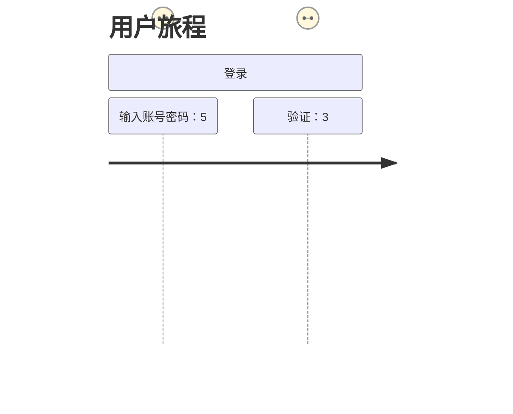

# Mermaid 图表工具 - Skill 参考文档

## 组件概述

**Mermaid** 是 Ant Design X 中用于渲染交互式 Mermaid 图表的组件，支持缩放、平移、图像/代码双视图切换等功能。

**安装依赖：**
```bash
npm install @ant-design/x
```

**基本导入：**
```tsx
import { Mermaid } from '@ant-design/x';
```

---

## 使用场景

### 1. 流程图渲染
渲染流程图、时序图、类图等 Mermaid 图表。

### 2. 与 Markdown 配合
与 XMarkdown 结合使用，在 Markdown 内容中渲染 Mermaid 图表。

### 3. 交互式图表
提供缩放、平移等交互功能的图表展示。

### 4. 代码/图像切换
支持在图表和源代码之间切换查看。

---

## 基础用法

### 基本使用

```tsx
import { Mermaid } from '@ant-design/x';

const App = () => (
  <Mermaid>
    {`graph TD
    A[开始] --> B{条件判断}
    B -->|是 | C[执行操作 A]
    B -->|否 | D[执行操作 B]
    C --> E[结束]
    D --> E`}
  </Mermaid>
);

export default App;
```

### 自定义 Header

```tsx
import { Mermaid } from '@ant-design/x';

const App = () => (
  <Mermaid
    header={
      <div style={{ padding: '8px', borderBottom: '1px solid #f0f0f0' }}>
        流程图标题
      </div>
    }
  >
    {`graph LR
    A[用户] --> B[登录]
    B --> C{验证成功？}
    C -->|是 | D[进入系统]
    C -->|否 | B`}
  </Mermaid>
);

export default App;
```

### Header 操作按钮

```tsx
import { Mermaid } from '@ant-design/x';
import { DownloadOutlined, ZoomInOutlined, ZoomOutOutlined } from '@ant-design/icons';
import { Button, Space } from 'antd';

const App = () => (
  <Mermaid
    header={
      <Space>
        <span>系统架构图</span>
        <Button type="text" icon={<ZoomInOutlined />} />
        <Button type="text" icon={<ZoomOutOutlined />} />
        <Button type="text" icon={<DownloadOutlined />}>
          下载
        </Button>
      </Space>
    }
  >
    {`graph TB
    subgraph 前端
      A[React]
      B[Ant Design X]
    end
    subgraph 后端
      C[Node.js]
      D[数据库]
    end
    A --> B
    B --> C
    C --> D`}
  </Mermaid>
);

export default App;
```

### 与 XMarkdown 配合使用

```tsx
import { Mermaid } from '@ant-design/x';
import XMarkdown from '@ant-design/x-markdown';

const markdownContent = `
# 系统流程

下面是系统的流程图：

\`\`\`mermaid
graph TD
    A[用户请求] --> B[API 网关]
    B --> C[认证服务]
    C --> D[业务服务]
    D --> E[数据库]
    E --> D
    D --> C
    C --> B
    B --> A
\`\`\`
`;

const App = () => (
  <XMarkdown
    components={{
      mermaid: ({ children }) => (
        <Mermaid>{String(children)}</Mermaid>
      ),
    }}
  >
    {markdownContent}
  </XMarkdown>
);

export default App;
```

---

## 进阶功能

### 1. 配置 Mermaid 主题

```tsx
import { Mermaid } from '@ant-design/x';
import { useMemo } from 'react';

const App = () => {
  const config = useMemo(
    () => ({
      theme: 'base',
      themeVariables: {
        primaryColor: '#1890ff',
        primaryBorderColor: '#096dd9',
        lineColor: '#595959',
      },
    }),
    []
  );

  return (
    <Mermaid config={config}>
      {`graph LR
    A[开始] --> B[处理]
    B --> C[结束]`}
    </Mermaid>
  );
};

export default App;
```

### 2. 自定义操作栏

```tsx
import { Mermaid } from '@ant-design/x';

const App = () => (
  <Mermaid
    actions={{
      enableZoom: true,
      enableDownload: true,
      enableCopy: true,
      customActions: [
        {
          key: 'share',
          label: '分享',
          onClick: () => console.log('Share chart'),
        },
      ],
    }}
  >
    {`sequenceDiagram
    participant A as 用户
    participant B as 前端
    participant C as 后端
    A->>B: 请求数据
    B->>C: API 调用
    C-->>B: 返回数据
    B-->>A: 展示结果`}
  </Mermaid>
);

export default App;
```

### 3. 渲染类型切换回调

```tsx
import { Mermaid } from '@ant-design/x';
import { useState } from 'react';

const App = () => {
  const [renderType, setRenderType] = useState<'image' | 'code'>('image');

  return (
    <Mermaid
      onRenderTypeChange={(type) => {
        setRenderType(type);
        console.log('Current render type:', type);
      }}
    >
      {`classDiagram
    class Animal {
      +String name
      +int age
      +eat()
      +sleep()
    }
    class Dog {
      +bark()
    }
    class Cat {
      +meow()
    }
    Animal <|-- Dog
    Animal <|-- Cat`}
    </Mermaid>
  );
};

export default App;
```

### 4. 自定义样式

```tsx
import { Mermaid } from '@ant-design/x';

const App = () => (
  <Mermaid
    className="custom-mermaid"
    classNames={{
      root: 'mermaid-root',
      header: 'mermaid-header',
      graph: 'mermaid-graph',
      code: 'mermaid-code',
    }}
    styles={{
      root: { border: '1px solid #d9d9d9', borderRadius: 8 },
      header: { background: '#fafafa' },
      graph: { padding: 16 },
    }}
  >
    {`pie
    "Chrome" : 65
    "Firefox" : 20
    "Safari" : 10
    "Others" : 5`}
  </Mermaid>
);

export default App;
```

---

## API 参考

### MermaidProps

| 属性 | 说明 | 类型 | 默认值 |
|------|------|------|--------|
| `children` | 代码内容 | `string` | - |
| `header` | 顶部 | `React.ReactNode \| null` | `React.ReactNode` |
| `className` | 样式类名 | `string` | - |
| `classNames` | 样式类名 | `Partial<Record<'root' \| 'header' \| 'graph' \| 'code', string>>` | - |
| `styles` | 样式对象 | `Partial<Record<'root' \| 'header' \| 'graph' \| 'code', React.CSSProperties>>` | - |
| `highlightProps` | 代码高亮配置 | [`highlightProps`](https://github.com/react-syntax-highlighter/react-syntax-highlighter?tab=readme-ov-file#props) | - |
| `config` | Mermaid 配置项 | `MermaidConfig` | - |
| `actions` | 操作栏配置 | `{ enableZoom?: boolean; enableDownload?: boolean; enableCopy?: boolean; customActions?: ItemType[] }` | `{ enableZoom: true, enableDownload: true, enableCopy: true }` |
| `onRenderTypeChange` | 渲染类型切换回调 | `(value: 'image' \| 'code') => void` | - |
| `prefixCls` | 样式前缀 | `string` | - |
| `style` | 自定义样式 | `React.CSSProperties` | - |

### MermaidConfig

Mermaid 配置项，参考 [Mermaid 官方配置](https://mermaid.js.org/config/configuration.html)。

常用配置：

```typescript
interface MermaidConfig {
  theme?: 'default' | 'base' | 'dark' | 'forest' | 'neutral';
  themeVariables?: {
    primaryColor?: string;
    primaryBorderColor?: string;
    lineColor?: string;
    fontFamily?: string;
  };
  flowchart?: {
    curve?: 'basis' | 'bumpX' | 'bumpY' | 'cardinal' | 'catmullRom' | 'linear' | 'monotoneX' | 'monotoneY' | 'natural' | 'step' | 'stepAfter' | 'stepBefore';
  };
  sequence?: {
    actorMargin?: number;
    boxMargin?: number;
    messageMargin?: number;
  };
}
```

### Actions

操作栏配置：

```typescript
interface Actions {
  enableZoom?: boolean;      // 启用缩放
  enableDownload?: boolean;  // 启用下载
  enableCopy?: boolean;      // 启用复制
  customActions?: ItemType[]; // 自定义操作
}
```

---

## 支持的图表类型

Mermaid 支持多种图表类型：

### 1. 流程图 (Flowchart)


### 2. 时序图 (Sequence Diagram)


### 3. 类图 (Class Diagram)


### 4. 状态图 (State Diagram)


### 5. 饼图 (Pie Chart)


### 6. 甘特图 (Gantt)


### 7. 用户旅程图 (User Journey)


---

## 主题变量 (Design Token)

可通过 `XProvider` 自定义主题：

```tsx
import { XProvider } from '@ant-design/x';

<XProvider
  theme={{
    components: {
      Mermaid: {
        // 自定义主题变量
      }
    }
  }}
>
  <App />
</XProvider>
```

---

## 最佳实践

### 1. 避免重复渲染

```tsx
import { Mermaid } from '@ant-design/x';
import { useMemo } from 'react';

const App = ({ isDark }) => {
  // 使用 useMemo 缓存配置，避免重复初始化
  const config = useMemo(
    () => ({
      theme: isDark ? 'dark' : 'base',
      fontFamily: 'monospace',
    }),
    [isDark]
  );

  return <Mermaid config={config}>{code}</Mermaid>;
};
```

### 2. 错误处理

```tsx
import { Mermaid } from '@ant-design/x';
import { Alert } from 'antd';
import { useState } from 'react';

const SafeMermaid = ({ code }) => {
  const [error, setError] = useState(false);

  if (error) {
    return <Alert message="图表渲染失败" type="error" />;
  }

  return (
    <Mermaid
      config={{ startOnLoad: false }}
      onRenderTypeChange={() => setError(false)}
    >
      {code}
    </Mermaid>
  );
};
```

### 3. 与 Bubble 配合展示流程图

```tsx
import { Bubble, Mermaid } from '@ant-design/x';

<Bubble
  content="这是系统架构图"
  contentRender={(content) => (
    <Mermaid>
      {`graph TB
      subgraph 用户层
        A[用户]
      end
      subgraph 应用层
        B[Web 应用]
        C[移动应用]
      end
      subgraph 服务层
        D[API 网关]
        E[微服务]
      end
      A --> B
      A --> C
      B --> D
      C --> D
      D --> E`}
    </Mermaid>
  )}
/>
```

### 4. 下载图表

```tsx
import { Mermaid } from '@ant-design/x';
import { useRef } from 'react';

const App = () => {
  const mermaidRef = useRef(null);

  const handleDownload = () => {
    // 获取图表 SVG 并下载
    const svgElement = mermaidRef.current?.nativeElement?.querySelector('svg');
    if (svgElement) {
      const svgData = new XMLSerializer().serializeToString(svgElement);
      const blob = new Blob([svgData], { type: 'image/svg+xml' });
      const url = URL.createObjectURL(blob);
      const link = document.createElement('a');
      link.href = url;
      link.download = 'chart.svg';
      link.click();
      URL.revokeObjectURL(url);
    }
  };

  return (
    <Mermaid ref={mermaidRef} header={<button onClick={handleDownload}>下载</button>}>
      {code}
    </Mermaid>
  );
};
```

---

## FAQ

### 使用 config 时，如何避免重复渲染或重复初始化？

当传递 `config` prop 时，请确保其为引用稳定的对象。避免在 JSX 中直接传入对象字面量（如 `config={{ theme: 'base' }}`），否则每次父组件重渲染都会触发 Mermaid 重新初始化。

**推荐做法：**

```tsx
// 动态配置：使用 useMemo 缓存
const config = React.useMemo(
  () => ({
    theme: isDark ? 'dark' : 'base',
    fontFamily: 'monospace',
  }),
  [isDark]
);

// 静态配置：提取为常量
const CONFIG = { theme: 'base', fontFamily: 'monospace' } as const;

<Mermaid config={config}>{code}</Mermaid>;
```

---

## 相关资源

- [Ant Design X 官方文档](https://x.ant.design)
- [Mermaid 官方文档](https://mermaid.js.org/)
- [@ant-design/x-markdown](../x-markdown/)
